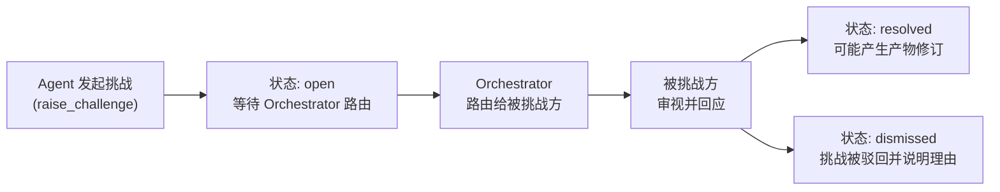
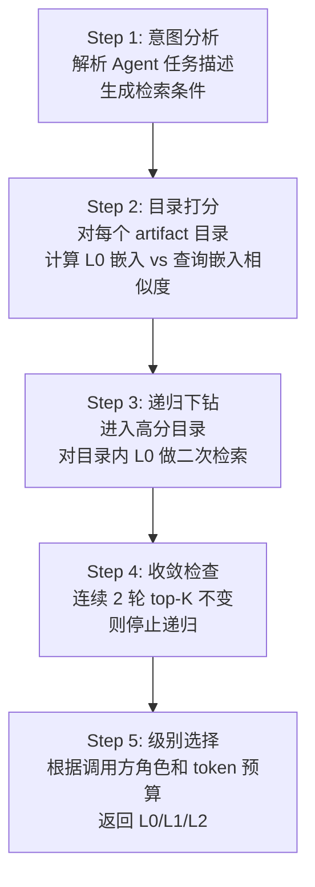
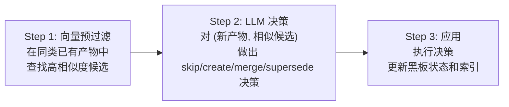
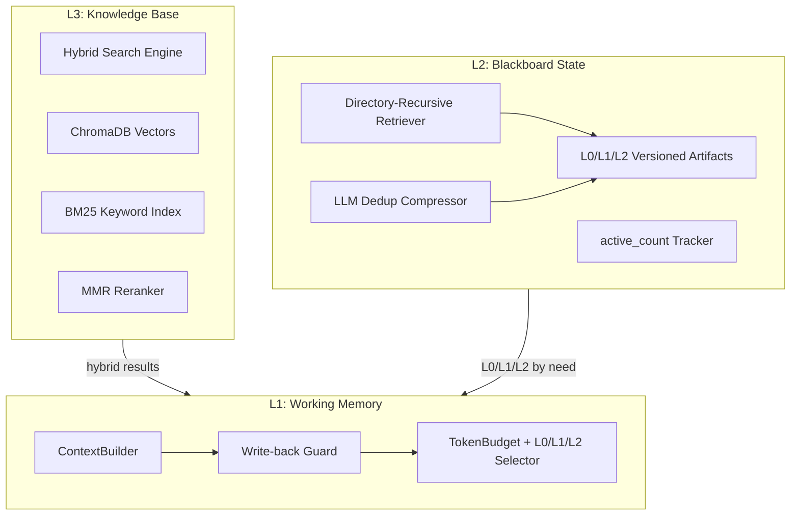
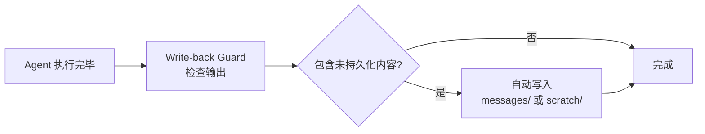
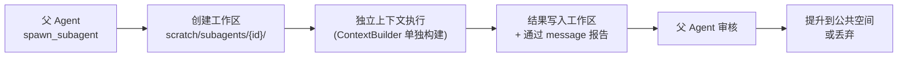
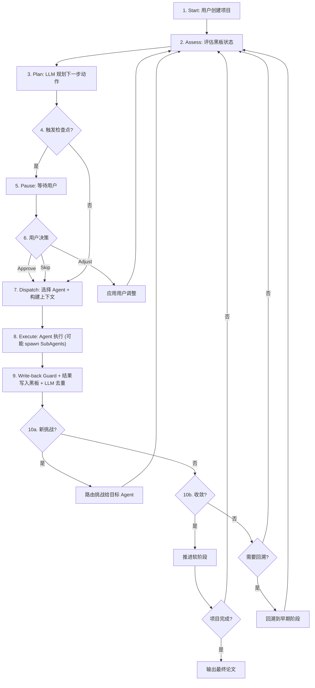

# AIDE Phase 2: MAS Core -- 多智能体系统核心

---

## 1. 目标与交付物概述

Phase 2 是 AIDE 系统的核心引擎层，构建完整的多智能体协作框架。目标是通过 API 可运行完整的**螺旋研究循环**，包含黑板协作、子代理并行和用户检查点。

| 交付物             | 说明                                                     |
| ------------------ | -------------------------------------------------------- |
| Blackboard Core    | L0/L1/L2 分级产物存储 + 目录递归检索 + 消息/挑战机制 + LLM 去重压缩 |
| 三层记忆系统       | ContextBuilder + L0/L1/L2 Selector + Write-back Guard    |
| Agent Pool         | 5 个专业 Agent (Director/Scientist/Librarian/Writer/Critic) + SubAgent 并行 |
| Orchestrator       | 螺旋循环 + 动态调度 + 收敛检测 + 回溯 + Heartbeat          |
| Checkpoint 系统    | Typed WebSocket API + 用户审核/调整/跳过 + 决策持久化       |

---

## 2. 黑板架构 (Blackboard Architecture)

### 2.1 设计哲学

AIDE 的黑板架构融合了两个理论基础:

- **Hayes-Roth 1985**: 经典 AI 黑板系统 -- 多个知识源 (KS) 围绕共享数据结构 (黑板) 协作，由控制模块决定激活顺序
- **bMAS (arXiv:2507.01701)**: 将黑板模式应用于 LLM 多智能体系统 -- Agent 不是线性传递的管道节点，而是围绕同一块"实验室白板"协作的研究团队成员

核心思想: **Agent 之间不直接通信，一切交互通过黑板完成**。这保证了透明性、可追溯性和可审计性。

### 2.2 L0/L1/L2 三级产物表示

源自 OpenViking 项目的核心洞察: 不同场景需要不同粒度的上下文。

黑板上的每个产物 (Artifact) 自动维护三个粒度级别:

| 级别 | 名称     | 规模        | 用途                             |
| ---- | -------- | ----------- | -------------------------------- |
| L0   | Abstract | ~50 tokens  | 检索时快速识别和过滤             |
| L1   | Overview | ~500 tokens | Agent 跨域决策时理解其他工作     |
| L2   | Details  | 完整内容    | 负责该产物的 Agent 深度编辑      |

**L0 示例**:

```
"假设H2: 基于Transformer注意力机制的稀疏化可在保持95%性能的前提下降低40%推理成本"
```

**L1 示例**: 假设的动机、核心前提、预测结果、关键引用、与其他假设的关系 (结构化 JSON)

**L2**: 完整的假设论证文档

**ContextBuilder 按角色选择粒度**:

| 调用场景                           | 选择级别                        |
| ---------------------------------- | ------------------------------- |
| Agent 读自己负责的产物             | L2 (完整内容)                   |
| Agent 读其他 Agent 的产物          | L1 (概览)                       |
| Orchestrator 做全局决策            | L0 (摘要列表) + 最相关 1-2 个 L1 |
| 检索匹配阶段                       | L0 做初筛                       |

**自动生成机制**: 当 Agent 写入 L2 时，Summarizer 自动用轻量模型生成对应的 L0 和 L1。版本更新时 L0/L1 同步更新。

### 2.3 公共空间 vs 私有空间

**公共空间** -- 所有 Agent 可读写:

| 目录          | 内容                                       |
| ------------- | ------------------------------------------ |
| `artifacts/`  | 三级研究产物 (L0/L1/L2 + 版本历史 + active_count) |
| `messages/`   | Agent 间异步消息 (信息请求、进展通知、发现分享)     |
| `challenges/` | 挑战/质疑 (任何 Agent 可对任何产物提出质疑)         |
| `decisions/`  | 决策日志 (上下文、选项、理由、结果)                 |
| `index/`      | 目录递归检索的倒排索引和向量索引                    |

**私有空间** -- 特定 Agent 临时工作区:

| 目录                            | 内容                           |
| ------------------------------- | ------------------------------ |
| `scratch/{agent_role}/`         | Agent 的草稿区                 |
| `scratch/subagents/{id}/`       | 子代理工作区                   |

### 2.4 文件系统存储结构

```
workspace/projects/{project_id}/
  blackboard/
    meta.json                       # 项目状态、当前阶段、迭代计数、heartbeat
    artifacts/
      directions/
        v1/
          l0.txt                    # ~50 tokens 一句话摘要
          l1.json                   # ~500 tokens 概览 (结构化)
          l2.json                   # 完整内容
          meta.json                 # 版本号、创建者、时间戳、active_count
        v2/
          ...
      hypotheses/
        v1/
          l0.txt / l1.json / l2.json / meta.json
      evidence/
        findings/
          {finding_id}/
            l0.txt / l1.json / l2.json / meta.json
        gaps.json
        experiment_guide.md
      outline/
        v1/
          l0.txt / l1.json / l2.json / meta.json
      draft/
        v1/
          l0.txt / l1.json / l2.md / meta.json
      review/
        v1/
          l0.txt / l1.json / l2.json / meta.json
    messages/
      {timestamp}_{from}_{to}.json
    challenges/
      {id}.json                     # status: open / resolved / dismissed
    decisions/
      {id}.json
    index/
      directory_tree.json           # 目录结构索引
      vector_index/                 # 黑板产物的 L0 嵌入索引
      bm25_index/                   # 关键词倒排索引
    scratch/
      director/
      scientist/
      librarian/
      writer/
      critic/
      subagents/
        {subagent_id}/
  checkpoints/
    {timestamp}_{phase}.json
  exports/
    paper.md
    paper.pdf
    references.bib
```

### 2.5 交互协议

每个 Agent 与黑板的交互遵循统一协议 `BlackboardAction`，定义 6 种动作:

```python
class BlackboardAction:
    agent_role: AgentRole
    action_type: Literal[
        "write_artifact",     # 写入/更新研究产物 (自动触发 L0/L1 生成)
        "post_message",       # 发送消息给其他 Agent 或全体
        "raise_challenge",    # 对某个产物提出质疑
        "resolve_challenge",  # 回应质疑
        "request_info",       # 请求特定信息
        "spawn_subagent",     # 生成子代理执行并行任务
    ]
    target: str               # 目标产物 / Agent / 挑战 ID
    content: dict             # 结构化内容
    rationale: str            # 行动理由 (用于决策日志)
    context_level: Literal["l0", "l1", "l2"]  # 读取目标时请求的粒度
```

| 动作类型            | 触发者     | 副作用                                     |
| ------------------- | ---------- | ------------------------------------------ |
| write_artifact      | 任意 Agent | 创建/更新产物版本，自动生成 L0/L1          |
| post_message        | 任意 Agent | 消息写入 `messages/`，通知目标 Agent        |
| raise_challenge     | 任意 Agent | 挑战写入 `challenges/`，Orchestrator 路由   |
| resolve_challenge   | 被挑战方   | 更新挑战状态，可能触发产物修订             |
| request_info        | 任意 Agent | 转化为 Librarian 任务或直接查询知识库      |
| spawn_subagent      | 特定 Agent | 创建子代理，分配工作区                     |

### 2.6 挑战 (Challenge) 机制

挑战是 AIDE 实现科研反馈回路的核心机制。任何 Agent 在任何时刻都可以对黑板上的任何产物发起挑战。

**挑战生命周期**:



**典型挑战场景**:

| 挑战者     | 挑战目标                 | 场景                                |
| ---------- | ------------------------ | ----------------------------------- |
| Scientist  | Director 的方向提案      | 认为该方向文献已饱和                |
| Librarian  | Scientist 的假设         | 找到的证据与假设矛盾               |
| Critic     | 论文草稿相关假设         | 发现论文草稿中的逻辑断裂           |
| Writer     | Scientist 的论证         | 撰写过程中暴露论证缺口             |

挑战数据结构:

```json
{
  "id": "challenge-001",
  "challenger": "librarian",
  "target_artifact": "artifacts/hypotheses/v1",
  "status": "open",
  "claim": "H2 的核心前提与 Smith 2024 矛盾",
  "evidence": ["evidence/findings/f-003"],
  "severity": "major",
  "created_at": "2026-02-27T10:30:00Z"
}
```

---

## 3. 目录递归检索

源自 OpenViking 的设计: 平面向量检索对层次化知识效果差，先定位目录 (大类) 再在目录内细搜，命中率显著提升。

### 3.1 五步检索流程



### 3.2 分数传播公式

当检索递归进入子目录时，子目录的分数综合自身匹配度和父目录的相关度:

```
child_score = 0.5 * own_score + 0.5 * parent_score
```

这保证了: 如果父目录 `artifacts/evidence/` 高度相关，其子目录 `artifacts/evidence/findings/` 也会获得基础分加成，即使具体 finding 的 L0 与查询匹配度一般。

### 3.3 收敛停止条件

当连续 2 轮递归下钻后，top-K 结果集合不变 (即新增的层级没有贡献更好的结果)，停止递归。这避免了在深度嵌套目录上的无效遍历。

---

## 4. LLM 去重压缩器

源自 OpenViking 的设计: 长时间运行的系统会积累大量记忆，需要智能去重而非简单截断。

### 4.1 三步处理流程



**Step 1: 向量预过滤**

对新写入的产物，在同类已有产物中使用 L0 嵌入计算余弦相似度，筛选出相似度 > 0.85 的候选。

**Step 2: LLM 决策**

用轻量模型对 (新产物, 相似候选) 做出决策:

| 决策       | 含义                               |
| ---------- | ---------------------------------- |
| skip       | 新产物是重复信息，不保留           |
| create     | 新产物包含新信息，保留             |
| merge      | 新产物扩展了已有产物，合并为新版本 |
| supersede  | 新产物取代了旧产物，旧产物标记废弃 |

**Step 3: 应用**

执行决策，更新黑板文件系统和检索索引。

### 4.2 按产物类型的合并策略

| 产物类型           | 可合并 | 策略说明                                     |
| ------------------ | ------ | -------------------------------------------- |
| hypotheses (假设)  | 可     | 核心前提相同但细节不同时合并                 |
| findings (证据)    | 不可   | 每条证据独立保留，但标注关联关系             |
| decisions (决策)   | 不可   | 每个决策是独立事件，不可合并                 |
| directions (方向)  | 可     | 同一方向的迭代细化可合并                     |
| outline (大纲)     | 可     | 结构变更可合并为新版本                       |
| draft (草稿)       | 可     | 章节修订可合并                               |

---

## 5. 三层记忆系统



### 5.1 L1: Working Memory (工作记忆)

每次 Agent 被调用时，ContextBuilder 从 L2 和 L3 中提取最相关信息，组装成符合上下文窗口限制的 prompt。

**Token 预算分配策略** (以 ~30K token budget 为例):

| 预算区域                 | 分配      | 内容                                   | 策略     |
| ------------------------ | --------- | -------------------------------------- | -------- |
| Core Context             | ~1.5K     | 项目 L0 摘要 + 当前阶段 L0 + 决策日志 L0 | 固定     |
| Task Context             | ~5K (17%) | 当前任务 + 自己产物 (L2) + 依赖产物 (L1) | 动态     |
| Cross-Agent Context      | ~3K (10%) | 其他 Agent 产出 (L1) + 开放挑战 + 消息  | 动态     |
| Literature Context       | ~13K (43%)| L3 混合检索文献片段                     | 动态     |
| History Context          | ~2K (7%)  | 产物版本演化链 (L0 摘要链)              | 动态     |
| Reserved                 | ~5K       | Agent 推理和输出空间                    | 留白     |

```python
class ContextBuilder:
    def build(self, agent: Agent, task: Task) -> str:
        budget = TokenBudget(total=30000)

        # 1. Core: L0 级别，永远不被裁切
        core = self.blackboard.project_summary(level="l0")
        core += self.blackboard.phase_summary(current=True, level="l0")
        core += self.blackboard.decision_digest(level="l0")
        budget.allocate("core", core, fixed=True)

        # 2. Task: 自己负责的产物用 L2，依赖的用 L1
        own = self.blackboard.get_artifacts(
            types=agent.primary_artifact_types,
            versions="latest", level="l2"
        )
        dep = self.blackboard.get_artifacts(
            types=agent.dependency_artifact_types,
            versions="latest", level="l1"
        )
        budget.allocate("task", own + dep, max_ratio=0.17)

        # 3. Cross-Agent: 其他 Agent 的产物用 L1 + 开放挑战
        cross = self.blackboard.get_cross_agent_context(
            exclude=agent.role, level="l1"
        )
        cross += self.blackboard.get_open_challenges()
        budget.allocate("cross", cross, max_ratio=0.10)

        # 4. Literature: 混合检索
        queries = self.derive_search_queries(task, agent)
        literature = self.knowledge_base.hybrid_search(
            queries, top_k=20,
            mmr_lambda=0.7,
            time_decay_factor=0.95
        )
        budget.allocate("literature", literature, max_ratio=0.43)

        # 5. History: 版本演化用 L0 链
        history = self.blackboard.get_artifact_evolution(
            types=agent.primary_artifact_types,
            level="l0", include_change_reasons=True
        )
        budget.allocate("history", history, max_ratio=0.07)

        return budget.assemble()
```

### 5.2 L2: Blackboard State (黑板状态层)

**active_count 追踪**: 每次 ContextBuilder 将某个产物加载到 Agent 上下文中时，该产物的 `active_count` +1。

| active_count 范围 | 含义                 | 预算策略              |
| ----------------- | -------------------- | --------------------- |
| 高频引用          | 核心产物             | 预算紧张时优先保留    |
| 低频引用          | 外围产物             | 优先用 L0 替代 L1/L2  |
| 从未引用          | 可能是噪声           | 标记为低优先级        |

**版本演化链**: 每个产物保留完整版本历史，通过 L0 摘要链快速回顾演化:

```
v1.L0 -> [变更理由: Critic 挑战后修订] -> v2.L0 -> [变更理由: 新证据补充] -> v3.L0
```

### 5.3 L3: Knowledge Base (知识库层)

即 Phase 1 中实现的混合检索引擎 (详见 Phase 1 文档第 5 节)。

### 5.4 Write-back Guard 机制

源自 OpenClaw: Agent 上下文切换时，当前对话中的推理过程和中间发现可能丢失。

当 Agent 完成一轮执行后，Write-back Guard 自动检查:

1. Agent 输出中是否包含**未持久化到黑板**的关键发现
2. Agent 推理过程中是否产生了对**其他 Agent 有价值**的洞察



确保**没有任何重要推理在上下文切换时丢失**。

---

## 6. Agent Pool

### 6.1 五个 Agent 能力矩阵

| 角色       | 职责                                 | 可读产物                                          | 可写产物                              | 可挑战              | 首选模型          | 可生成子代理 |
| ---------- | ------------------------------------ | ------------------------------------------------- | ------------------------------------- | ------------------- | ----------------- | ------------ |
| Director   | 方向提案、战略调整、冲突裁决         | 全部 L0/L1 + 自己 L2                               | directions/, decisions/               | -- (最终裁决者)     | Opus 4.6          | 否           |
| Scientist  | 假设构建、方法论设计、技术论证       | directions(L1), evidence(L2), review(L1)           | hypotheses/, evidence/gaps.json       | Director, Librarian | DeepSeek Reasoner | 是 (多假设并行) |
| Librarian  | 文献检索、证据收集、知识库维护       | hypotheses(L1), directions(L1), challenges         | evidence/, messages                   | Scientist           | Gemini 3.1 Pro    | 是 (多库并行)  |
| Writer     | 大纲设计、分章节撰写、修订润色       | 全部 artifacts (按级别)                            | outline/, draft/                      | Scientist           | GPT 5.3           | 是 (多章节并行) |
| Critic     | 质量评审、一致性检查、改进建议       | 全部黑板内容 (L1 为主)                             | review/, challenges                   | 所有 Agent          | Opus 4.6          | 否           |

### 6.2 BaseAgent 抽象类设计

```python
class BaseAgent(ABC):
    role: AgentRole
    system_prompt: str
    preferred_model: str
    primary_artifact_types: list[str]
    dependency_artifact_types: list[str]
    challengeable_roles: list[AgentRole]
    can_spawn_subagents: bool

    async def execute(self, context: str, task: Task) -> list[BlackboardAction]:
        prompt = self.build_prompt(context, task)
        response = await self.llm_router.call(
            model=self.preferred_model,
            messages=[
                {"role": "system", "content": self.system_prompt},
                {"role": "user", "content": prompt}
            ],
            response_format=AgentResponse
        )
        actions = self.parse_actions(response)
        actions += self.write_back_guard.check(response, actions)
        return actions
```

关键设计点:

- `primary_artifact_types`: Agent 负责的产物类型，ContextBuilder 以 L2 加载
- `dependency_artifact_types`: Agent 依赖的产物类型，以 L1 加载
- `challengeable_roles`: 该 Agent 可以挑战哪些 Agent
- `can_spawn_subagents`: 控制子代理生成权限
- `write_back_guard.check()`: 在返回前检查并持久化遗漏的推理

### 6.3 SubAgent 系统

源自 nanobot: 某些任务天然可并行 (多数据源检索、多章节撰写)。

```python
class SubAgent:
    parent_role: AgentRole
    task: str
    tools: list[str]       # 受限工具集
    model: str             # 可用轻量模型
    workspace: str         # scratch/subagents/{id}/
```

**生命周期**:



**约束条件**:

| 约束                         | 说明                                   |
| ---------------------------- | -------------------------------------- |
| 独立上下文                   | 不继承父 Agent 的对话历史               |
| 不可发起 Challenge           | 防止子代理干扰主协作流程               |
| 不可 spawn 更多子代理        | 防止递归爆炸                           |
| 输出先写入 scratch            | 由父 Agent 审核后决定是否提升           |
| 单 Agent 最多 3 个子代理     | 控制并行资源消耗                       |
| Orchestrator 追踪状态        | 所有活跃子代理对 Orchestrator 可见     |

---

## 7. Orchestrator

Orchestrator 扮演 "PI (实验室导师)" 角色: 观察全局状态 -> 判断下一步 -> 调度 Agent -> 处理反馈 -> 判断收敛或回溯。

### 7.1 螺旋研究循环流程图



### 7.2 Next-Action Planning

Orchestrator 使用 Opus 4.6 进行元认知决策。每个循环步骤中读取黑板 L0 层全景:

- 所有产物的 L0 摘要列表
- 未解决挑战的摘要
- 当前迭代轮次和收敛指标
- 子代理状态 (running / completed)

输出结构化决策:

```python
class OrchestratorDecision:
    agent_to_invoke: AgentRole
    task_description: str
    task_priority: Literal["critical", "normal", "exploratory"]
    allow_subagents: bool
    trigger_checkpoint: bool
    checkpoint_reason: str | None
    backtrack_to: str | None
    rationale: str
```

### 7.3 收敛检测

Orchestrator 判断是否推进到下一阶段的信号:

| 信号             | 条件                                   | 权重  |
| ---------------- | -------------------------------------- | ----- |
| 无开放挑战       | 当前阶段所有 Challenge 已 resolved/dismissed | 必要  |
| 质量阈值         | Critic 最近评审分数高于阈值            | 必要  |
| 稳定性           | 最近 N 轮迭代没有重大修订              | 辅助  |
| 最大迭代保护     | 每个阶段有最大迭代次数上限             | 安全  |

当所有必要信号达标时，Orchestrator 触发对应阶段的用户检查点。

### 7.4 回溯机制

当新发现推翻了之前的工作时，Orchestrator 可以回溯到早期阶段:

| 触发条件                             | 回溯目标        |
| ------------------------------------ | --------------- |
| Librarian 找到的证据直接否定假设     | 假设阶段        |
| Writer 撰写中发现论证逻辑断裂        | 证据收集阶段    |
| Critic 发现方向本身有根本问题        | 方向阶段        |

回溯时:

1. 被推翻的产物标记为 `superseded`
2. 保留历史版本供参考
3. Orchestrator 从回溯目标阶段重新开始调度

### 7.5 Heartbeat 健康监控

源自 nanobot。研究项目可能持续数小时甚至数天，需要可靠性保障。

| 功能             | 行为                                             |
| ---------------- | ------------------------------------------------ |
| 定期检查         | 每 N 分钟检查 Orchestrator/Agent/WebSocket 是否活跃 |
| 异常检测         | Agent 超时未响应 -> 重试或换模型; 连续失败 -> 暂停并通知 |
| 进度快照         | 定期将完整黑板状态序列化到 `meta.json`            |
| 崩溃恢复         | 系统重启后从最近快照恢复，不丢失研究进度         |

---

## 8. Checkpoint 系统

### 8.1 Typed WebSocket API

Checkpoint 通过 WebSocket 实现实时交互，采用三类帧结构:

| 帧类型   | 方向             | 用途                             |
| -------- | ---------------- | -------------------------------- |
| Request  | 客户端 -> 服务端 | 用户发起操作 (approve/adjust/skip) |
| Response | 服务端 -> 客户端 | 操作确认/错误响应                |
| Push     | 服务端 -> 客户端 | 主动推送 (新检查点、进度更新)    |

### 8.2 四种用户操作

| 操作     | 说明                                       | 后续行为                       |
| -------- | ------------------------------------------ | ------------------------------ |
| Approve  | 确认当前成果，推进到下一阶段               | Orchestrator 推进软阶段        |
| Adjust   | 提供修改意见                               | 系统带着调整指令重新迭代       |
| Skip     | 让 Orchestrator 自主判断                   | Orchestrator 按收敛信号决策    |
| 超时     | 可配置 (默认 30 min)                       | 等同于 Skip                    |

### 8.3 决策持久化

每次检查点决策写入:

1. PostgreSQL `checkpoints` 表 (结构化记录)
2. 文件系统 `checkpoints/{timestamp}_{phase}.json` (完整上下文快照)

---

## 9. 典型研究循环示例 (37 轮)

以下是一个完整研究项目的典型执行流程:

```
Round  1:  Orchestrator -> Director (提出 3 个方向)
Round  2:  Orchestrator -> Librarian (对 3 个方向做初步文献调研)
             Librarian spawns 3 SubAgents (并行检索 Semantic Scholar / arXiv / PDF 库)
Round  3:  SubAgents 完成 -> Librarian 综合 -> 写入黑板
Round  4:  Orchestrator -> Critic (评估哪个方向最有潜力)
Round  5:  [CHECKPOINT 1] -> User 选择方向 B

Round  6:  Orchestrator -> Scientist (基于方向 B 生成假设 H1, H2, H3)
Round  7:  Orchestrator -> Librarian (深度检索 H1, H2, H3 的相关文献)
Round  8:  Librarian -> [CHALLENGE] "H2 的核心前提与 Smith 2024 矛盾"
Round  9:  Orchestrator -> Scientist (读取 Challenge L2 完整论据，重新审视 H2)
Round 10:  Scientist -> 修订 H2 为 H2' (写入 v2, Summarizer 自动生成 L0/L1)
Round 11:  Orchestrator -> Critic (评审修订后的假设集, 读 L1 概览)
Round 12:  Critic -> "假设集质量通过阈值"
Round 13:  [CHECKPOINT 2] -> User 确认假设集

Round 14:  Orchestrator -> Librarian (系统性证据收集)
             Librarian spawns SubAgents (并行: 正面证据 / 反面证据 / 方法论先例)
Round 15:  Orchestrator -> Scientist (分析证据缺口, 生成实验指导)
Round 16:  Librarian -> [CHALLENGE] "H1 的证据全部来自同一研究组, 可能有偏"
Round 17:  Orchestrator -> Director (裁决: 是否调整方向)
Round 18:  Director -> "保持方向, 论文中标注此局限性" (写入 decisions/)
           ...

Round 28:  Orchestrator -> Writer (准备撰写论文)
Round 29:  Writer spawns 4 SubAgents (并行撰写 Intro / Methods / Results / Discussion)
Round 30:  SubAgents 完成 -> Writer 整合为完整草稿
             Write-back Guard 检测到 Writer 推理中发现的论证缺口 -> 自动写入 messages/
Round 31:  Orchestrator -> Critic (全面评审, 读草稿 L2)
Round 32:  Critic -> [CHALLENGE] "第 3 章论证有缺口" (回溯信号)
Round 33:  Orchestrator [BACKTRACK] -> EVIDENCE 阶段
Round 34:  Librarian 补充检索 -> Dedup Compressor 合并新旧证据
Round 35:  Writer 修订第 3 章
Round 36:  Critic -> 通过
Round 37:  [CHECKPOINT 5] -> User 最终审核 -> 导出
```

此示例展示了 AIDE 的核心特征:

- **螺旋迭代**: 不是线性流水线，而是反复评审修订
- **挑战机制**: Agent 之间自然形成反馈回路 (Round 8, 16, 32)
- **子代理并行**: 可并行的任务自动分发 (Round 2, 14, 29)
- **回溯**: 当后续工作发现前期问题时可以回退 (Round 33)
- **用户检查点**: 关键节点等待用户确认 (Round 5, 13, 37)
