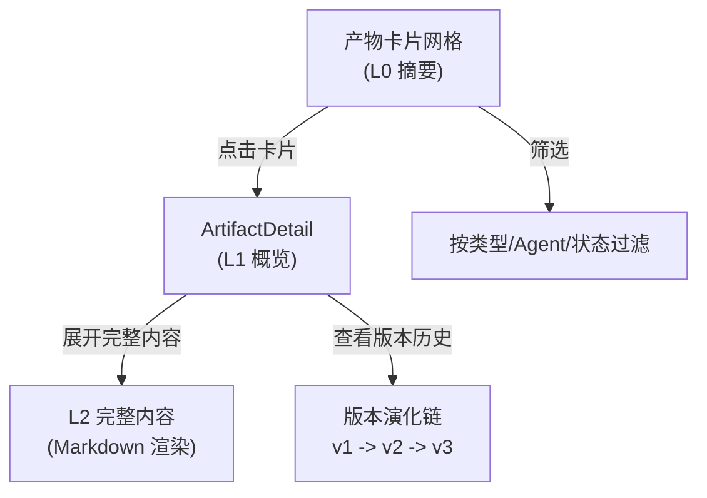
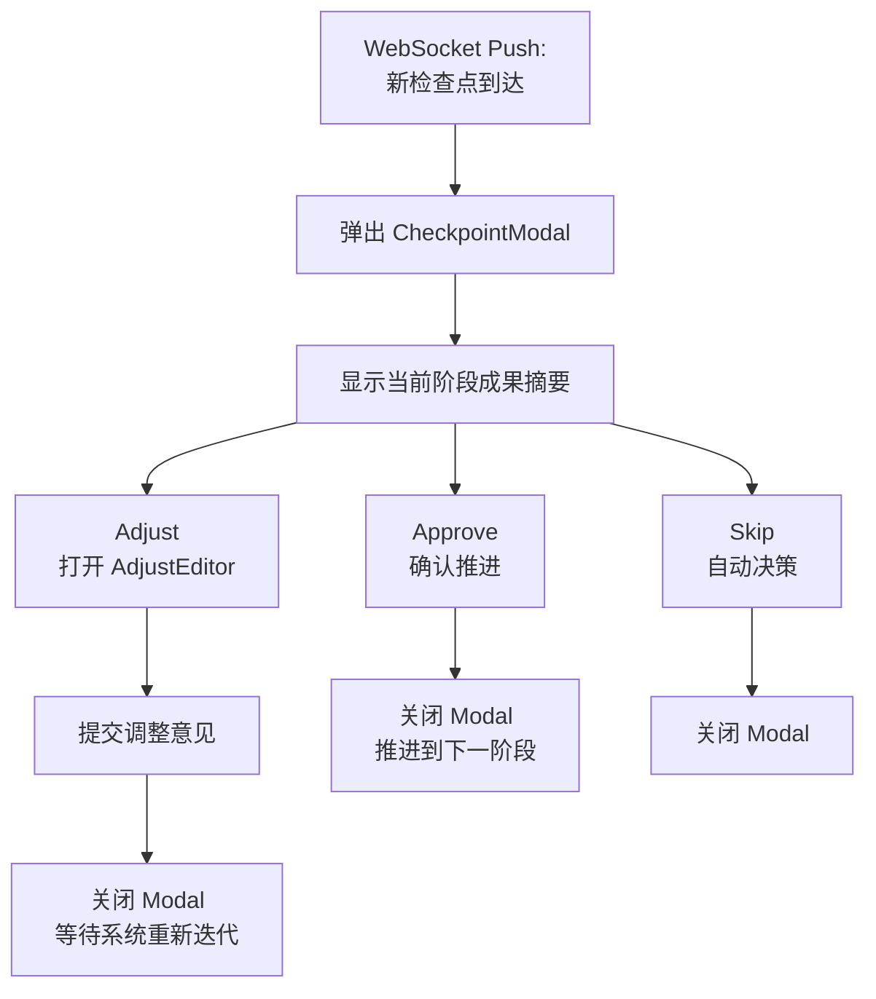

# AIDE Phase 3: Web Dashboard -- Web 交互界面

---

## 1. 目标与交付物概述

Phase 3 构建完整可交互的 Web 应用，让用户通过直观的界面管理研究项目、观察多智能体协作过程、与检查点交互、管理知识库。

| 交付物                 | 说明                                         |
| ---------------------- | -------------------------------------------- |
| Dashboard 首页         | 项目卡片网格，快速概览所有研究项目           |
| 项目详情页             | 三栏布局: 阶段进度 / 黑板视图 / 挑战与消息  |
| 设置页                 | API 密钥管理 + 模型偏好 + 研究默认值         |
| 实时通信层             | Typed WebSocket 实现黑板状态实时同步         |
| 检查点交互             | Approve / Adjust / Skip 模态框               |

---

## 2. 技术栈

| 技术           | 版本  | 用途                           |
| -------------- | ----- | ------------------------------ |
| Next.js        | 15    | React 全栈框架 (App Router)   |
| React          | 19    | UI 组件库                      |
| Tailwind CSS   | 4     | 原子化 CSS 样式                |
| lucide-react   | --    | 图标库                         |
| recharts       | --    | 数据可视化图表                 |
| react-markdown | --    | Markdown / LaTeX 渲染          |

不使用 shadcn/ui 的预构建组件，而是基于 Tailwind CSS 自建符合 AIDE 设计语言的组件系统。

---

## 3. 设计语言

### 3.1 暗色主题色板

AIDE 采用暗色主题，营造科研实验室仪表盘的专业氛围。

| 用途       | 色值                    | Tailwind 类名     |
| ---------- | ----------------------- | ------------------ |
| 主背景     | `#020617`               | `slate-950`        |
| 卡片背景   | `#0f172a`               | `slate-900`        |
| 次级背景   | `#1e293b`               | `slate-800`        |
| 边框       | `#334155`               | `slate-700`        |
| 主文字     | `#f1f5f9`               | `slate-100`        |
| 次文字     | `#94a3b8`               | `slate-400`        |
| 强调色     | `#3b82f6`               | `blue-500`         |
| 警告色     | `#fbbf24`               | `amber-400`        |
| 成功色     | `#22c55e`               | `green-500`        |
| 错误色     | `#ef4444`               | `red-500`          |
| 挑战高亮   | `#f97316`               | `orange-500`       |

### 3.2 科研实验室仪表盘美学

设计理念:

- **信息密度优先**: 一屏内展示尽可能多的上下文信息
- **层次分明**: 通过背景色深浅区分信息层级
- **状态可见**: 每个组件的运行状态 (空闲/活跃/完成/错误) 用颜色编码
- **无装饰性元素**: 不使用渐变、阴影过渡等装饰，保持工具感

### 3.3 组件设计规范

| 规范           | 标准                                 |
| -------------- | ------------------------------------ |
| 圆角           | `rounded-lg` (8px)                   |
| 间距           | 模块间 `gap-4`，模块内 `gap-2`       |
| 字体           | 等宽字体用于代码/数据，无衬线用于正文 |
| 动画           | 仅用于状态变化提示，不做入场动画     |
| 响应式         | 桌面端优先 (1280px+)，适配 1024px    |

---

## 4. 页面结构

### 4.1 Dashboard 首页

路径: `/`

```
+----------------------------------------------------------+
|  AIDE                                    [Settings]       |
+----------------------------------------------------------+
|                                                           |
|  [+ New Project]                                          |
|                                                           |
|  +----------------+  +----------------+  +----------------+
|  | Project Alpha  |  | Project Beta   |  | Project Gamma  |
|  | Phase: EVIDENCE|  | Phase: COMPOSE |  | Phase: EXPLORE |
|  | Iteration: 14  |  | Iteration: 28  |  | Iteration: 3   |
|  | Status: RUNNING|  | Status: PAUSED |  | Status: IDLE   |
|  | 12 Artifacts   |  | 23 Artifacts   |  | 2 Artifacts    |
|  | 2 Challenges   |  | 0 Challenges   |  | 0 Challenges   |
|  +----------------+  +----------------+  +----------------+
|                                                           |
+----------------------------------------------------------+
```

每个项目卡片显示:

- 项目名称
- 当前软阶段 (EXPLORE / HYPOTHESIZE / EVIDENCE / COMPOSE)
- 迭代轮次
- 运行状态 (颜色编码)
- 产物数量和未解决挑战数

### 4.2 项目详情页 (三栏布局)

路径: `/projects/[id]`

```
+----------------------------------------------------------+
|  AIDE > Project Alpha                   [Pause] [Export]  |
+----------------------------------------------------------+
| Phase      |  Blackboard View         | Challenges &      |
| Progress   |                          | Messages           |
|            |  +------+  +------+      |                   |
| [EXPLORE]  |  |Dir v2|  |Hyp v3|     | [!] Challenge #3  |
|  v         |  +------+  +------+      |   H2 与 Smith     |
| [HYPOTHE.] |  +------+  +------+      |   2024 矛盾       |
|  v         |  |Evid. |  |Draft |      |   status: open    |
| [EVIDENCE] |  |12 fnd|  |v1    |      |                   |
|  * current |  +------+  +------+      | --- Messages ---  |
| [COMPOSE]  |                          | Librarian: 找到   |
|            |  SubAgents:              |   3篇相关论文      |
| Iteration  |  [SA-1: running]         | Scientist: 修订   |
| 14 / 30    |  [SA-2: complete]        |   假设H2           |
+----------------------------------------------------------+
```

三栏:

| 栏位     | 内容                                       | 宽度比 |
| -------- | ------------------------------------------ | ------ |
| 左栏     | 阶段进度指示器 + 迭代计数 + 螺旋可视化    | 20%    |
| 中栏     | 黑板视图 (产物卡片 + 子代理状态)          | 50%    |
| 右栏     | 挑战面板 + 消息流                          | 30%    |

### 4.3 设置页

路径: `/settings`

```
+----------------------------------------------------------+
|  AIDE > Settings                                          |
+----------------------------------------------------------+
|  API Keys                                                 |
|  +------------------------------------------------------+ |
|  | DeepSeek API Key    [**********dk-xxx]  [Test] [Save]| |
|  | OpenRouter API Key  [**********or-xxx]  [Test] [Save]| |
|  +------------------------------------------------------+ |
|                                                           |
|  Model Preferences                                        |
|  +------------------------------------------------------+ |
|  | Director:    [Opus 4.6        v]                     | |
|  | Scientist:   [DeepSeek Reasoner v]                   | |
|  | Librarian:   [Gemini 3.1 Pro  v]                     | |
|  | Writer:      [GPT 5.3         v]                     | |
|  | Critic:      [Opus 4.6        v]                     | |
|  +------------------------------------------------------+ |
|                                                           |
|  Research Defaults                                        |
|  +------------------------------------------------------+ |
|  | Checkpoint Timeout:  [30] min                        | |
|  | Max Iterations/Phase:[30]                            | |
|  | MMR Lambda:          [0.7]                           | |
|  | Time Decay Factor:   [0.95]                          | |
|  +------------------------------------------------------+ |
+----------------------------------------------------------+
```

---

## 5. 核心组件说明

### 5.1 黑板可视化组件族

| 组件             | 文件                          | 功能                                       |
| ---------------- | ----------------------------- | ------------------------------------------ |
| BoardView        | `blackboard/BoardView.tsx`    | 实时展示所有产物的 L0 卡片网格             |
| ArtifactDetail   | `blackboard/ArtifactDetail.tsx`| 点击卡片展开 L1/L2 详情 (侧面板或模态框)  |
| ChallengePanel   | `blackboard/ChallengePanel.tsx`| 挑战列表 (open/resolved/dismissed 分组)    |
| MessageStream    | `blackboard/MessageStream.tsx` | Agent 消息实时流 (类似聊天界面)            |
| SubAgentStatus   | `blackboard/SubAgentStatus.tsx`| 子代理活动指示器 (running/completed/failed) |

**BoardView 交互流程**:



**ChallengePanel 状态颜色**:

| 状态      | 颜色         | 含义             |
| --------- | ------------ | ---------------- |
| open      | `orange-500` | 待处理           |
| resolved  | `green-500`  | 已解决           |
| dismissed | `slate-500`  | 已驳回           |

### 5.2 检查点交互组件

| 组件             | 文件                              | 功能                         |
| ---------------- | --------------------------------- | ---------------------------- |
| CheckpointModal  | `checkpoint/CheckpointModal.tsx`  | 检查点弹窗 (摘要 + 三个按钮) |
| AdjustEditor     | `checkpoint/AdjustEditor.tsx`     | 用户调整意见输入编辑器       |

**CheckpointModal 交互流程**:



### 5.3 管线可视化组件

| 组件               | 文件                              | 功能                         |
| ------------------ | --------------------------------- | ---------------------------- |
| PhaseIndicator     | `pipeline/PhaseIndicator.tsx`     | 软阶段进度条 (4 阶段 + 回溯箭头) |
| SpiralVisualizer   | `pipeline/SpiralVisualizer.tsx`   | 迭代螺旋动画 (展示研究循环轨迹)  |

PhaseIndicator 显示四个软阶段:

```
EXPLORE  ->  HYPOTHESIZE  ->  EVIDENCE  ->  COMPOSE
  [done]      [done]          [current]     [pending]
                 ^                |
                 +--- backtrack --+
```

SpiralVisualizer 使用 SVG 绘制螺旋轨迹，每一轮迭代对应螺旋上的一个节点。节点颜色表示执行的 Agent，悬停显示该轮的摘要。

### 5.4 论文组件

| 组件           | 文件                      | 功能                         |
| -------------- | ------------------------- | ---------------------------- |
| PaperPreview   | `paper/PaperPreview.tsx`  | Markdown + LaTeX 只读渲染    |
| PaperEditor    | `paper/PaperEditor.tsx`   | 行内编辑器 (用户微调论文)    |

PaperPreview 使用 `react-markdown` 渲染，支持:

- Markdown 基础格式
- LaTeX 数学公式 (KaTeX)
- 代码块语法高亮
- 引用文献超链接

### 5.5 知识库组件

| 组件           | 文件                          | 功能                         |
| -------------- | ----------------------------- | ---------------------------- |
| PDFUploader    | `knowledge/PDFUploader.tsx`   | 拖拽上传 PDF + 处理进度      |
| SearchTester   | `knowledge/SearchTester.tsx`  | 混合搜索测试 UI              |
| CitationGraph  | `knowledge/CitationGraph.tsx` | 引用网络力导向图可视化       |

**PDFUploader** 支持:

- 拖拽或点击上传
- 批量上传多个文件
- 上传进度条
- 处理状态 (uploading / processing / indexed / error)

**SearchTester** 提供一个输入框和结果面板，用于测试混合检索效果:

- 输入搜索查询
- 显示检索结果 (标题、摘要、分数、来源)
- 标注结果来自向量检索还是 BM25 还是两者
- 调节参数 (MMR lambda, time decay)

### 5.6 UI 基础组件

| 组件   | 说明                               |
| ------ | ---------------------------------- |
| Card   | 暗色卡片容器 (`slate-900` 背景)    |
| Badge  | 状态标签 (颜色编码)               |
| Button | 三种变体: primary / secondary / ghost |
| Modal  | 模态对话框 (居中覆盖层)           |
| Input  | 文本输入框 (暗色主题适配)         |

---

## 6. 实时通信

### 6.1 Typed WebSocket 协议

源自 OpenClaw 的 Typed WebSocket API 设计。三类帧:

| 帧类型     | 方向                | 结构                                   |
| ---------- | ------------------- | -------------------------------------- |
| Request    | 客户端 -> 服务端    | `{ type: "request", id, method, params }` |
| Response   | 服务端 -> 客户端    | `{ type: "response", id, result, error }` |
| Push       | 服务端 -> 客户端    | `{ type: "push", event, data }`           |

**Request/Response** 是请求-响应模式，通过 `id` 字段配对:

```typescript
// 客户端发送
{ type: "request", id: "req-001", method: "checkpoint.approve", params: { checkpoint_id: "cp-1" } }

// 服务端响应
{ type: "response", id: "req-001", result: { success: true } }
```

**Push** 是服务端主动推送:

```typescript
// 新产物更新
{ type: "push", event: "artifact.updated", data: { type: "hypotheses", version: 2, l0: "..." } }

// 新检查点
{ type: "push", event: "checkpoint.created", data: { id: "cp-2", phase: "evidence", summary: "..." } }

// Agent 状态变更
{ type: "push", event: "agent.status", data: { role: "librarian", status: "executing", task: "..." } }
```

### 6.2 useTypedWebSocket Hook

```typescript
function useTypedWebSocket(url: string) {
  // 管理 WebSocket 连接生命周期
  // 自动重连 (指数退避)
  // Request/Response 配对 (Promise-based)
  // Push 事件订阅

  return {
    send: (method: string, params: object) => Promise<Result>,
    subscribe: (event: string, handler: (data) => void) => unsubscribe,
    status: "connecting" | "connected" | "disconnected",
  };
}
```

关键特性:

- **自动重连**: 连接断开后使用指数退避策略重连
- **请求配对**: `send()` 返回 Promise，通过 `id` 自动匹配 Response
- **事件订阅**: `subscribe()` 注册 Push 事件处理器，返回取消订阅函数
- **类型安全**: 所有帧结构在 `ws-protocol.ts` 中定义 TypeScript 类型

### 6.3 useBlackboard Hook

```typescript
function useBlackboard(projectId: string) {
  // 订阅黑板状态变更
  // 维护本地黑板状态缓存
  // 提供按类型/Agent 过滤的视图

  return {
    artifacts: Artifact[],          // 当前所有产物 (L0)
    challenges: Challenge[],        // 当前所有挑战
    messages: Message[],            // 消息流
    subagents: SubAgentStatus[],    // 子代理状态
    phase: Phase,                   // 当前阶段
    iteration: number,              // 当前迭代
  };
}
```

基于 `useTypedWebSocket`，自动订阅黑板相关的 Push 事件 (`artifact.updated`, `challenge.created`, `message.posted` 等)，维护前端状态。

---

## 7. API 客户端设计

前端使用统一的 API 客户端 (`lib/api.ts`) 与后端通信:

```typescript
class AIDEClient {
  private baseUrl: string;

  // 项目管理
  async listProjects(): Promise<Project[]>;
  async getProject(id: string): Promise<Project>;
  async createProject(data: CreateProjectRequest): Promise<Project>;
  async updateProject(id: string, data: UpdateProjectRequest): Promise<Project>;
  async deleteProject(id: string): Promise<void>;
  async startProject(id: string): Promise<void>;
  async pauseProject(id: string): Promise<void>;

  // PDF 管理
  async uploadPDF(file: File): Promise<Paper>;
  async listPapers(): Promise<Paper[]>;
  async deletePaper(id: string): Promise<void>;
  async searchPapers(query: string, params?: SearchParams): Promise<SearchResult[]>;

  // 检查点
  async getCheckpoints(projectId: string): Promise<Checkpoint[]>;
  async approveCheckpoint(id: string): Promise<void>;
  async adjustCheckpoint(id: string, feedback: string): Promise<void>;
  async skipCheckpoint(id: string): Promise<void>;

  // 设置
  async getSettings(): Promise<Settings>;
  async updateSettings(data: Settings): Promise<void>;
  async testApiKey(provider: string, key: string): Promise<boolean>;
}
```

设计原则:

- 所有方法返回 Promise，支持 async/await
- 错误统一通过自定义 `APIError` 类抛出
- 自动附加认证头 (如有)
- 请求/响应类型通过 TypeScript 接口定义
