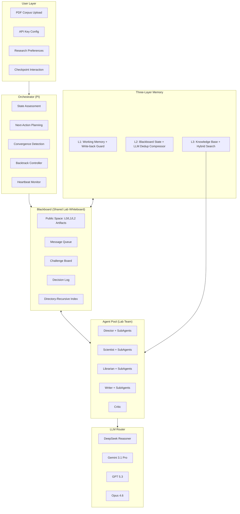
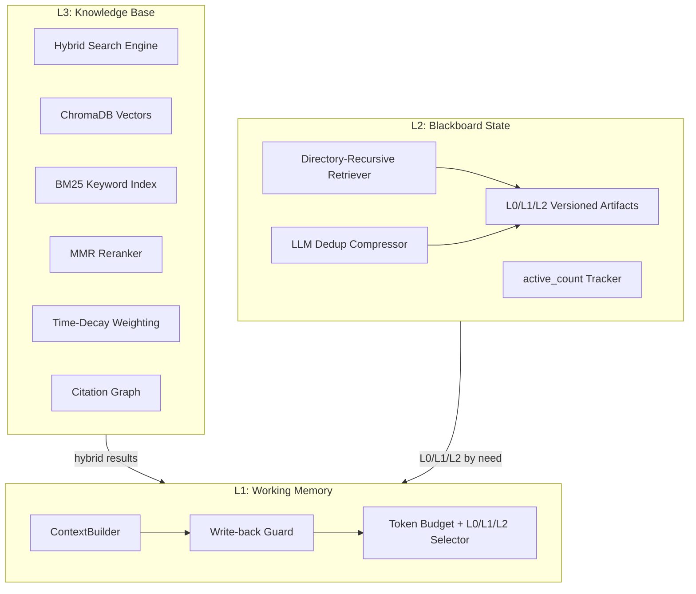
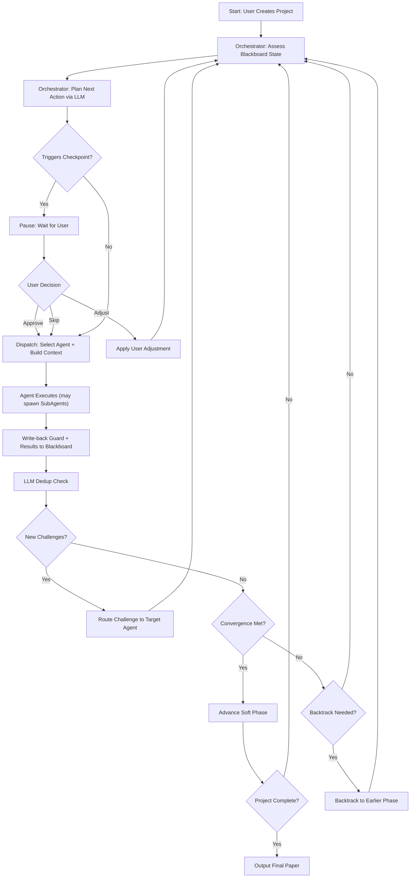

# AIDE: AI for Discovery & Exploration -- 完整系统方案 v3

> v3 变更: 融合 OpenViking / nanobot / OpenClaw 三个参考项目的核心设计到 AIDE 架构中。

## 0. 核心设计哲学

AIDE 的第一性原理: **科研是螺旋式前进的，不是流水线式的。**

FARS 用线性流水线（Ideation -> Planning -> Experiment -> Writing）实现了工业级产量，但牺牲了科研的本质特征 -- 反复质疑、回溯修正、交叉验证。AIDE 不追求产量，追求一篇高质量论文的诞生过程尽可能接近真实实验室的协作方式。

AIDE 与 FARS 的根本差异:

- **FARS**: 线性流水线 / 全自动无人值守 / AI4AI / GPU集群跑实验 / 工业级产量(100篇/9.5天)
- **AIDE**: 黑板架构MAS / 螺旋迭代+用户检查点 / AI4Science / 证据收集+实验指导 / 单篇质量优先

### 参考项目提取的关键设计 (v3 新增)


| 来源         | 提取的设计                              | 在AIDE中的位置                      |
| ---------- | ---------------------------------- | ------------------------------ |
| OpenViking | L0/L1/L2 三级上下文表示                   | Blackboard 产物存储、ContextBuilder |
| OpenViking | 目录递归检索 + 分数传播 + 收敛停止               | 黑板检索引擎                         |
| OpenViking | 自动记忆压缩 + LLM 去重决策                  | 迭代历史归档                         |
| OpenViking | active_count 使用频率追踪                | 上下文优先级排序                       |
| OpenClaw   | 混合搜索 (Vector + BM25 + MMR)         | 知识库检索                          |
| OpenClaw   | 记忆回写守卫 (Write-back Before Flush)   | Agent 上下文切换                    |
| OpenClaw   | 时间衰减权重                             | 检索结果排序                         |
| OpenClaw   | Typed WebSocket API (Req/Res/Push) | 前端实时通信                         |
| nanobot    | 子代理并行 (spawn/report)               | Agent 并行任务                     |
| nanobot    | Heartbeat 健康检查                     | 长时间运行项目的可靠性                    |


---

## 1. 系统架构总览




---

## 2. 黑板架构 (Blackboard Architecture) -- 核心协作机制

借鉴经典 AI 黑板架构 (Hayes-Roth 1985) 和最新 LLM 黑板系统 (bMAS, arXiv:2507.01701), AIDE 的 Agent 不是线性传递的管道节点，而是围绕同一块"实验室白板"协作的研究团队成员。

### 2.1 L0/L1/L2 三级产物表示 (源自 OpenViking)

> OpenViking 的核心洞察: 不同场景需要不同粒度的上下文。用 L0 快速识别、L1 辅助决策、L2 深度阅读，按需加载可大幅减少 token 消耗。

黑板上的**每个产物 (Artifact)** 都自动维护三个粒度级别:

- **L0 (Abstract)**: 一句话摘要 (~50 tokens) -- 用于检索时快速识别和过滤。
例: `"假设H2: 基于Transformer注意力机制的稀疏化可在保持95%性能的前提下降低40%推理成本"`
- **L1 (Overview)**: 核心信息+上下文+关键依赖 (~500 tokens) -- 用于 Agent 跨域决策时理解其他Agent的工作，无需读完整内容。
例: 假设的动机、核心前提、预测结果、关键引用、与其他假设的关系
- **L2 (Details)**: 完整内容 -- 用于负责该产物的 Agent 进行深度编辑或回应质疑时使用。

**ContextBuilder 按角色选择粒度**:

- Agent 读自己负责的产物 -> L2 (完整内容)
- Agent 读其他 Agent 的产物 -> L1 (概览)
- Orchestrator 做全局决策 -> L0 (摘要列表) + 最相关的 1-2 个 L1
- 检索匹配阶段 -> L0 做初筛

**自动生成机制**: 当 Agent 写入 L2 时，Summarizer 自动用轻量模型生成对应的 L0 和 L1。版本更新时 L0/L1 同步更新。

### 2.2 黑板数据结构

黑板分为 **公共空间** 和 **私有空间**:

**公共空间** -- 所有 Agent 可读写:

- `artifacts/` -- 三级研究产物，每个产物包含 L0/L1/L2 + 版本历史 + active_count
- `messages/` -- Agent 间异步消息（信息请求、进展通知、发现分享）
- `challenges/` -- 挑战/质疑（任何 Agent 可对任何产物提出质疑，附带论据）
- `decisions/` -- 决策日志（每个关键决策的上下文、选项、理由、结果）
- `index/` -- 目录递归检索的倒排索引和向量索引

**私有空间** -- 特定 Agent 临时工作区:

- `scratch/{agent_role}/` -- Agent 的草稿区，用于深度推理和中间计算
- 子代理 (SubAgent) 的工作也在此区域，完成后结论提升到公共空间

**文件系统实现**:

```
workspace/projects/{project_id}/
  blackboard/
    meta.json                       # 项目状态、当前阶段、迭代计数、heartbeat
    artifacts/
      directions/
        v1/
          l0.txt                    # ~50 tokens 一句话摘要
          l1.json                   # ~500 tokens 概览(结构化)
          l2.json                   # 完整内容
          meta.json                 # 版本号、创建者、时间戳、active_count
        v2/
          ...
      hypotheses/
        v1/
          l0.txt / l1.json / l2.json / meta.json
      evidence/
        findings/
          {finding_id}/
            l0.txt / l1.json / l2.json / meta.json
        gaps.json
        experiment_guide.md
      outline/
        v1/
          l0.txt / l1.json / l2.json / meta.json
      draft/
        v1/
          l0.txt / l1.json / l2.md / meta.json
      review/
        v1/
          l0.txt / l1.json / l2.json / meta.json
    messages/
      {timestamp}_{from}_{to}.json
    challenges/
      {id}.json                     # status: open/resolved/dismissed
    decisions/
      {id}.json
    index/
      directory_tree.json           # 目录结构索引 (用于递归检索)
      vector_index/                 # 黑板产物的L0嵌入索引
      bm25_index/                   # 关键词倒排索引
    scratch/
      director/
      scientist/
      librarian/
      writer/
      critic/
      subagents/                    # 子代理工作区
        {subagent_id}/
  checkpoints/
    {timestamp}_{phase}.json
  exports/
    paper.md
    paper.pdf
    references.bib
```

### 2.3 黑板交互协议

每个 Agent 与黑板的交互遵循统一协议:

```python
class BlackboardAction:
    agent_role: AgentRole
    action_type: Literal[
        "write_artifact",    # 写入/更新研究产物 (自动触发L0/L1生成)
        "post_message",      # 发送消息给其他Agent或全体
        "raise_challenge",   # 对某个产物提出质疑
        "resolve_challenge", # 回应质疑
        "request_info",      # 请求特定信息
        "spawn_subagent",    # 生成子代理执行并行任务 (v3新增)
    ]
    target: str              # 目标产物/Agent/挑战ID
    content: dict            # 结构化内容
    rationale: str           # 行动理由 (用于决策日志)
    context_level: Literal["l0", "l1", "l2"]  # 读取目标时请求的粒度
```

**关键机制 -- 挑战(Challenge)**:

任何 Agent 在任何时刻都可以对黑板上的任何产物发起挑战。例如:

- Scientist 读到 Director 的方向提案后，认为该方向文献已饱和 -> 发起 Challenge
- Librarian 找到的证据与 Scientist 的假设矛盾 -> 发起 Challenge
- Critic 发现论文草稿中的逻辑断裂 -> 发起 Challenge 指向相关假设

Orchestrator 检测到 Challenge 后，会调度被质疑方重新审视，形成自然的**反馈回路**。

---

## 3. 三层记忆系统

这是解决"Agent遗忘/遗漏"问题的核心设计，v3 中进行了大幅强化。




### 3.1 L1: Working Memory (工作记忆)

每次 Agent 被调用时，ContextBuilder 从 L2 和 L3 中提取最相关信息，按 L0/L1/L2 粒度选择，组装成符合上下文窗口限制的 prompt。

**上下文预算分配策略** (以 ~30K token budget 为例):

- **Core Context (固定, ~1.5K)**: 项目L0摘要 + 当前阶段L0摘要 + 决策日志L0摘要 -- Agent 永远不会迷失
- **Task Context (动态, ~5K)**: 当前任务描述 + 直接负责的产物 (L2完整) + 依赖产物 (L1概览)
- **Cross-Agent Context (动态, ~3K)**: 其他Agent最新产出 (L1) + 未解决挑战 + 相关消息
- **Literature Context (动态, ~13K)**: 从 L3 混合检索的文献片段 (Vector+BM25+MMR去重+时间衰减)
- **History Context (动态, ~2K)**: 产物版本演化链 (v1.L0 -> v2变更理由 -> v3.L0 -> ...)
- **Reserved (留白, ~5K)**: Agent推理和输出空间

```python
class ContextBuilder:
    def build(self, agent: Agent, task: Task) -> str:
        budget = TokenBudget(total=30000)

        # 1. Core: L0 级别，永远不被裁切
        core = self.blackboard.project_summary(level="l0")
        core += self.blackboard.phase_summary(current=True, level="l0")
        core += self.blackboard.decision_digest(level="l0")
        budget.allocate("core", core, fixed=True)

        # 2. Task: 自己负责的产物用L2，依赖的用L1
        own_artifacts = self.blackboard.get_artifacts(
            types=agent.primary_artifact_types,
            versions="latest", level="l2"
        )
        dep_artifacts = self.blackboard.get_artifacts(
            types=agent.dependency_artifact_types,
            versions="latest", level="l1"
        )
        budget.allocate("task", own_artifacts + dep_artifacts, max_ratio=0.17)

        # 3. Cross-Agent: 其他Agent的产物用L1 + 开放挑战
        cross = self.blackboard.get_cross_agent_context(
            exclude=agent.role, level="l1"
        )
        cross += self.blackboard.get_open_challenges()
        budget.allocate("cross", cross, max_ratio=0.10)

        # 4. Literature: 混合检索 (Vector + BM25 + MMR + TimeDecay)
        queries = self.derive_search_queries(task, agent)
        literature = self.knowledge_base.hybrid_search(
            queries, top_k=20,
            mmr_lambda=0.7,       # 多样性-相关性平衡
            time_decay_factor=0.95 # 近期文献权重更高
        )
        budget.allocate("literature", literature, max_ratio=0.43)

        # 5. History: 版本演化用L0链
        history = self.blackboard.get_artifact_evolution(
            types=agent.primary_artifact_types,
            level="l0", include_change_reasons=True
        )
        budget.allocate("history", history, max_ratio=0.07)

        return budget.assemble()
```

#### Write-back Guard (记忆回写守卫, 源自 OpenClaw)

> OpenClaw 的洞察: Agent 上下文切换时，当前对话中的推理过程和中间发现可能丢失。必须在"刷新"前自动持久化。

当 Agent 完成一轮执行后，Write-back Guard 自动检查:

1. Agent 的输出中是否包含未持久化到黑板的关键发现？
2. Agent 的推理过程中是否产生了对其他 Agent 有价值的洞察？

如果检测到未持久化内容，自动将其写入黑板的 `messages/` (通知) 或 `scratch/` (草稿)，确保**没有任何重要推理在上下文切换时丢失**。

### 3.2 L2: Blackboard State (黑板状态层)

#### 目录递归检索 (源自 OpenViking)

> OpenViking 的洞察: 平面向量检索对层次化知识效果差。先定位目录(大类)再在目录内细搜，命中率显著提升。

黑板的目录结构本身就是语义组织:

- `artifacts/directions/` -- 研究方向相关
- `artifacts/hypotheses/` -- 假设相关
- `artifacts/evidence/findings/` -- 证据发现

**检索流程**:

```
Step 1: Intent Analysis
  输入: Agent的当前任务描述
  输出: 多个检索条件 (queries + target_categories)

Step 2: Directory Scoring
  对每个 artifact 目录计算相关度分数
  使用 L0 嵌入 vs 查询嵌入的相似度

Step 3: Recursive Drill-down
  进入高分目录 -> 对目录内的 L0 做二次检索
  如有子目录(如evidence/findings/) -> 递归
  分数传播: child_score = 0.5 * own_score + 0.5 * parent_score

Step 4: Convergence
  当连续 2 轮 top-K 结果不变时停止递归

Step 5: Level Selection
  根据调用方角色和token预算，返回 L0/L1/L2 级别的结果
```

#### LLM 去重压缩器 (源自 OpenViking)

> OpenViking 的洞察: 长时间运行的系统会积累大量记忆，需要智能去重而非简单截断。

当黑板产物数量超过阈值（或迭代轮次过多）时:

```
Step 1: Vector Pre-filter
  对新写入的产物，在同类已有产物中查找高相似度候选

Step 2: LLM Dedup Decision
  用轻量模型对 (新产物, 相似候选) 做出决策:
  - skip: 新产物是重复信息，不保留
  - create: 新产物包含新信息，保留
  - merge: 新产物扩展了已有产物，合并为新版本
  - supersede: 新产物取代了旧产物，旧产物标记为superseded

Step 3: Apply
  执行决策，更新黑板状态和索引
```

不同产物类型的合并策略不同:

- 假设(hypotheses): 可合并 -- 如果核心前提相同但细节不同
- 证据(findings): 不可合并 -- 每条证据独立保留，但标注关联
- 决策(decisions): 不可合并 -- 每个决策是独立事件
- 方向(directions): 可合并 -- 如果是同一方向的迭代细化

#### active_count 使用频率追踪 (源自 OpenViking)

每次 ContextBuilder 将某个产物加载到 Agent 上下文中时，该产物的 `active_count` +1。这为上下文预算分配提供信号:

- 高频引用的产物 -> 在预算紧张时优先保留
- 低频引用的产物 -> 优先用 L0 摘要替代 L1/L2
- 从未引用的产物 -> 可能是噪声，标记为低优先

### 3.3 L3: Knowledge Base (知识库层)

#### 混合检索引擎 (源自 OpenClaw)

> OpenClaw 的洞察: 单纯向量检索对精确术语(作者名、方法名、公式)效果差。BM25 关键词匹配作为补充，MMR 去冗余，时间衰减提升近期文献权重。

```python
class HybridSearchEngine:
    def search(self, queries: list[str], top_k: int = 20,
               mmr_lambda: float = 0.7,
               time_decay_factor: float = 0.95) -> list[SearchResult]:
        # 1. Vector Search (语义相似度)
        vec_results = self.chromadb.query(queries, n_results=top_k * 2)

        # 2. BM25 Search (关键词精确匹配)
        bm25_results = self.bm25_index.query(queries, n_results=top_k * 2)

        # 3. Score Fusion (RRF - Reciprocal Rank Fusion)
        fused = reciprocal_rank_fusion(vec_results, bm25_results)

        # 4. Time Decay
        for r in fused:
            age_years = (now - r.publish_date).days / 365
            r.score *= time_decay_factor ** age_years

        # 5. MMR Reranking (最大边际相关性, 减少冗余)
        reranked = mmr_rerank(fused, lambda_param=mmr_lambda, top_k=top_k)

        return reranked
```

组成:

- **ChromaDB**: 用户 PDF 语料库 + 联网检索文献的嵌入向量
- **BM25 Index**: 同一语料库的关键词倒排索引 (使用 rank_bm25 库，轻量级)
- **Citation Graph**: 论文引用关系 (NetworkX)，支持核心论文发现、知识脉络追踪
- **PDF Metadata Index**: 标题/作者/年份/摘要 的结构化索引，支持精确过滤

---

## 4. Orchestrator -- 螺旋研究循环

Orchestrator 扮演"PI(实验室导师)"角色：观察全局状态 -> 判断下一步 -> 调度 Agent -> 处理反馈 -> 判断收敛或回溯。

### 4.1 循环核心逻辑




### 4.2 Orchestrator 的 Next-Action Planning

Orchestrator 使用 Opus 4.6 进行元认知决策。每个循环步骤中，它读取黑板的 L0 层全景:

- 所有产物的 L0 摘要列表
- 未解决挑战的摘要
- 当前迭代轮次和收敛指标
- 子代理状态 (running/completed)

然后输出结构化决策:

```python
class OrchestratorDecision:
    agent_to_invoke: AgentRole
    task_description: str
    task_priority: Literal["critical", "normal", "exploratory"]
    allow_subagents: bool               # 是否允许该Agent生成子代理
    trigger_checkpoint: bool
    checkpoint_reason: Optional[str]
    backtrack_to: Optional[str]
    rationale: str
```

### 4.3 收敛检测

Orchestrator 判断是否可以推进到下一阶段的信号:

- **无开放挑战**: 当前阶段的所有 Challenge 都已 resolved 或 dismissed
- **质量阈值**: Critic 最近一次评审分数高于阈值
- **稳定性**: 最近 N 轮迭代没有产生新的重大修订
- **最大迭代保护**: 每个阶段有最大迭代次数上限(防止死循环)

### 4.4 回溯机制

当新发现推翻了之前的工作时，Orchestrator 可以回溯:

- Librarian 找到的证据直接否定假设 -> 回溯到假设阶段
- Writer 在撰写过程中发现论证逻辑断裂 -> 回溯到证据收集
- Critic 评审发现方向本身有根本问题 -> 回溯到方向阶段

回溯时，被推翻的产物标记为 `superseded`，保留历史版本供参考。

### 4.5 Heartbeat 健康监控 (源自 nanobot)

研究项目可能持续数小时甚至数天。Heartbeat 服务:

- 每 N 分钟检查: Orchestrator 是否活跃、各 Agent 是否响应正常、WebSocket 连接是否存活
- 异常检测: Agent 超时未响应 -> 重试或换模型; 连续失败 -> 暂停并通知用户
- 进度快照: 定期将完整黑板状态序列化到 `meta.json`，支持崩溃恢复
- 自动恢复: 系统重启后从最近快照恢复，不丢失研究进度

---

## 5. Agent Pool -- 实验室角色定义

5个专业 Agent + Orchestrator + 按需生成的子代理 (SubAgent)。

### 5.1 Agent 能力矩阵

- **Director (方向策略)**
  - 职责: 研究方向提案、战略性调整、跨Agent冲突裁决
  - 可读: 全部黑板 L0/L1 + 自己产物的 L2
  - 可写: `artifacts/directions/`, `decisions/`
  - 可挑战: 无 (是最终裁决者)
  - 首选模型: Opus 4.6
- **Scientist (假设推理)**
  - 职责: 假设构建、方法论设计、实验数据需求分析、技术论证
  - 可读: directions(L1), evidence(L2), review(L1)
  - 可写: `artifacts/hypotheses/`, `artifacts/evidence/gaps.json`
  - 可挑战: Director 的方向, Librarian 的证据解读
  - 首选模型: DeepSeek Reasoner
  - 可生成子代理: 并行分析多个假设的可行性
- **Librarian (文献证据)**
  - 职责: 文献检索/综合、证据收集、数据提取、知识库维护
  - 可读: hypotheses(L1), directions(L1), challenges
  - 可写: `artifacts/evidence/`, messages (文献发现通知)
  - 可挑战: Scientist 的假设 (如果找到矛盾证据)
  - 首选模型: Gemini 3.1 Pro
  - 特殊工具: Hybrid Search (Vector+BM25), Web Literature API, Citation Graph
  - 可生成子代理: 并行检索多个数据库 (Semantic Scholar / arXiv / Google Scholar)
- **Writer (论文撰写)**
  - 职责: 论文大纲设计、分章节撰写、修订润色、参考文献管理
  - 可读: 全部 artifacts (directions L1, hypotheses L1, evidence L2, outline L2, draft L2)
  - 可写: `artifacts/outline/`, `artifacts/draft/`
  - 可挑战: Scientist (如果论证逻辑在写作中暴露断裂)
  - 首选模型: GPT 5.3
  - 可生成子代理: 并行撰写不同章节 (Introduction / Methods / Results / Discussion)
- **Critic (质量评审)**
  - 职责: 阶段性质量评审、一致性检查、缺口发现、改进建议
  - 可读: 全部黑板内容 (L1 为主, 必要时读 L2)
  - 可写: `artifacts/review/`, challenges
  - 可挑战: 所有 Agent 的所有产物
  - 首选模型: Opus 4.6
  - 不可生成子代理 (评审需要全局一致性判断, 不宜拆分)

### 5.2 子代理系统 (SubAgent, 源自 nanobot)

> nanobot 的洞察: 某些任务天然可并行（多数据源检索、多章节撰写），子代理提供了受控的并行能力。

```python
class SubAgent:
    parent_role: AgentRole        # 谁生成的
    task: str                     # 子任务描述
    tools: list[str]              # 受限工具集 (不能生成子代理、不能发起挑战)
    model: str                    # 可用轻量模型降低成本
    workspace: str                # scratch/subagents/{id}/

    async def execute(self) -> SubAgentResult:
        """独立上下文执行，完成后通过 blackboard message 报告结果"""
        ...
```

约束:

- 子代理有独立的 ContextBuilder 构建的上下文（不继承父 Agent 的对话历史）
- 子代理**不能**发起 Challenge 或 spawn 更多子代理（防止递归爆炸）
- 子代理的输出写入 `scratch/subagents/`，由父 Agent 审核后决定是否提升到公共空间
- 单个 Agent 同时最多 spawn 3 个子代理
- Orchestrator 追踪所有活跃子代理状态

### 5.3 Agent 基类设计

```python
class BaseAgent(ABC):
    role: AgentRole
    system_prompt: str
    preferred_model: str
    primary_artifact_types: list[str]
    dependency_artifact_types: list[str]    # v3: 读取其他Agent产物时用L1
    challengeable_roles: list[AgentRole]
    can_spawn_subagents: bool               # v3: 是否可生成子代理

    async def execute(self, context: str, task: Task) -> list[BlackboardAction]:
        prompt = self.build_prompt(context, task)
        response = await self.llm_router.call(
            model=self.preferred_model,
            messages=[
                {"role": "system", "content": self.system_prompt},
                {"role": "user", "content": prompt}
            ],
            response_format=AgentResponse
        )
        actions = self.parse_actions(response)
        # v3: Write-back Guard 检查未持久化的推理
        actions += self.write_back_guard.check(response, actions)
        return actions
```

---

## 6. 软阶段与检查点

虽然不是线性流水线，但研究过程有自然的"软阶段"，用于组织检查点:

```mermaid
flowchart LR
    subgraph explore ["EXPLORE Phase"]
        E1["Director proposes"]
        E2["Librarian surveys"]
        E3["Critic evaluates"]
    end
    subgraph hypothesize ["HYPOTHESIZE Phase"]
        H1["Scientist generates"]
        H2["Librarian deep-dives"]
        H3["Critic challenges"]
    end
    subgraph evidence ["EVIDENCE Phase"]
        EV1["Librarian collects"]
        EV2["Scientist analyzes gaps"]
        EV3["Director may pivot"]
    end
    subgraph compose ["COMPOSE Phase"]
        C1["Writer outlines"]
        C2["Writer drafts (parallel sections)"]
        C3["Scientist verifies"]
        C4["Critic reviews"]
    end

    explore -->|"CP1: Direction Review"| hypothesize
    hypothesize -->|"CP2: Hypothesis Review"| evidence
    evidence -->|"CP3: Evidence Review"| compose
    compose -->|"CP4: Draft Review"| Final["CP5: Final Export"]

    hypothesize -.->|"backtrack"| explore
    evidence -.->|"backtrack"| hypothesize
    compose -.->|"backtrack"| evidence
```




每个 Phase 内部是多轮迭代的（Orchestrator 驱动），Phase 之间通过收敛检测推进。虚线表示可能的回溯路径。

**检查点触发时机**: Orchestrator 判断某个阶段收敛时，自动触发该阶段的用户检查点。用户可以:

- **Approve**: 确认当前成果，推进到下一阶段
- **Adjust**: 提供修改意见，系统带着调整后的指令重新在当前阶段迭代
- **Skip**: 让 Orchestrator 自主判断是否推进
- **超时自动跳过**: 可配置 (默认 30 min)

---

## 7. 典型研究循环示例

```
Round 1:  Orchestrator -> Director (提出3个方向)
Round 2:  Orchestrator -> Librarian (对3个方向做初步文献调研)
            Librarian spawns 3 SubAgents (并行检索 Semantic Scholar / arXiv / PDF库)
Round 3:  SubAgents 完成 -> Librarian 综合 -> 写入黑板
Round 4:  Orchestrator -> Critic (评估哪个方向最有潜力)
Round 5:  [CHECKPOINT 1] -> User 选择方向B
Round 6:  Orchestrator -> Scientist (基于方向B生成假设H1, H2, H3)
Round 7:  Orchestrator -> Librarian (深度检索H1, H2, H3的相关文献)
Round 8:  Librarian -> [CHALLENGE] "H2的核心前提与Smith 2024矛盾" (引用L2证据)
Round 9:  Orchestrator -> Scientist (读取Challenge的L2完整论据，重新审视H2)
Round 10: Scientist -> 修订H2为H2' (写入v2, Summarizer自动生成L0/L1)
Round 11: Orchestrator -> Critic (评审修订后的假设集, 读L1概览)
Round 12: Critic -> "假设集质量通过阈值"
Round 13: [CHECKPOINT 2] -> User 确认假设集
Round 14: Orchestrator -> Librarian (系统性证据收集)
            Librarian spawns SubAgents (并行: 正面证据 / 反面证据 / 方法论先例)
Round 15: Orchestrator -> Scientist (分析证据缺口, 生成实验指导)
Round 16: Librarian -> [CHALLENGE] "H1的证据全部来自同一研究组, 可能有偏"
Round 17: Orchestrator -> Director (裁决: 是否调整方向)
Round 18: Director -> "保持方向, 论文中标注此局限性" (写入 decisions/)
...
Round 28: Orchestrator -> Writer (准备撰写论文)
Round 29: Writer spawns 4 SubAgents (并行撰写 Intro / Methods / Results / Discussion)
Round 30: SubAgents 完成 -> Writer 整合为完整草稿
            Write-back Guard 检测到 Writer 推理中发现的论证缺口 -> 自动写入 messages/
Round 31: Orchestrator -> Critic (全面评审, 读草稿L2)
Round 32: Critic -> [CHALLENGE] "第3章论证有缺口" (回溯信号)
Round 33: Orchestrator [BACKTRACK] -> EVIDENCE 阶段
Round 34: Librarian 补充检索 -> Dedup Compressor 合并新旧证据
Round 35: Writer 修订第3章
Round 36: Critic -> 通过
Round 37: [CHECKPOINT 5] -> User 最终审核 -> 导出
```

---

## 8. 技术栈

- **Backend**: Python 3.12 + FastAPI + SQLAlchemy + Alembic
- **Agent Framework**: 自研轻量级框架 (Pydantic structured output, 不依赖 LangChain)
- **Blackboard Storage**: File System (workspace/) + PostgreSQL (metadata, message index, checkpoints)
- **Vector DB**: ChromaDB (100+ papers, ~10K-15K chunks)
- **BM25 Index**: rank_bm25 (轻量级纯Python实现, 与ChromaDB互补)
- **Embedding**: `text-embedding-3-small` (OpenAI) 或本地 `bge-m3`
- **Real-time**: Typed WebSocket API (FastAPI native, Request/Response/Server-Push 三类帧)
- **Frontend**: Next.js 15 + React 19 + Tailwind CSS + shadcn/ui
- **PDF Processing**: PyMuPDF (text/table extraction) + pdfplumber (fallback)
- **Citation Graph**: NetworkX (轻量图计算)
- **Containerization**: Docker Compose (backend + frontend + postgres + chromadb)

---

## 9. 项目目录结构

```
aide/
  backend/
    main.py                          # FastAPI app entry
    config.py                        # Settings (Pydantic BaseSettings)
    models/                          # SQLAlchemy DB models
      project.py
      checkpoint.py
      token_usage.py
    api/                             # REST + WebSocket endpoints
      projects.py
      papers.py
      checkpoints.py
      settings.py
      ws.py                          # Typed WebSocket handler (Req/Res/Push)
    blackboard/                      # Blackboard Architecture
      board.py                       # Blackboard class (read/write/query)
      actions.py                     # BlackboardAction definitions
      challenge.py                   # Challenge lifecycle management
      levels.py                      # L0/L1/L2 representation + auto-generation
      retriever.py                   # Directory-recursive retriever
      compressor.py                  # LLM dedup compressor
      active_tracker.py              # active_count usage tracking
    memory/                          # Three-Layer Memory
      context_builder.py             # L1: Working Memory assembler + L0/L1/L2 selector
      token_budget.py                # Token budget allocation
      write_back_guard.py            # Auto-persist unpersisted reasoning
    agents/                          # Agent Pool
      base.py                        # BaseAgent ABC
      subagent.py                    # SubAgent spawning + lifecycle
      director.py
      scientist.py
      librarian.py
      writer.py
      critic.py
      prompts/                       # System prompts (Jinja2 templates)
        director.j2
        scientist.j2
        librarian.j2
        writer.j2
        critic.j2
    orchestrator/                    # Orchestrator (PI)
      engine.py                      # Main research loop
      planner.py                     # Next-action LLM planner
      convergence.py                 # Convergence detection logic
      backtrack.py                   # Backtrack controller
      heartbeat.py                   # Health monitoring + crash recovery
    knowledge/                       # Knowledge Base (L3)
      pdf_processor.py               # PDF ingestion pipeline
      vector_store.py                # ChromaDB operations
      bm25_store.py                  # BM25 keyword index
      hybrid_search.py               # Vector + BM25 + MMR + TimeDecay fusion
      web_retriever.py               # Semantic Scholar + arXiv API
      citation_graph.py              # NetworkX citation graph
      embeddings.py                  # Embedding generation
    llm/                             # LLM Router
      router.py                      # Model routing logic
      providers/
        deepseek.py                  # DeepSeek Reasoner client
        openrouter.py                # OpenRouter (Gemini/GPT/Opus)
      tracker.py                     # Token usage + cost tracking
    checkpoint/                      # Checkpoint System
      manager.py                     # Checkpoint lifecycle
      events.py                      # Typed WebSocket event definitions
  frontend/
    src/
      app/                           # Next.js app router
        page.tsx                     # Dashboard home
        projects/[id]/page.tsx       # Project detail (Blackboard view)
        settings/page.tsx            # API key + preferences
      components/
        blackboard/                  # Blackboard visualization
          BoardView.tsx              # Real-time L0/L1 artifact cards
          ArtifactDetail.tsx         # L2 full content viewer
          ChallengePanel.tsx         # Challenge thread view
          MessageStream.tsx          # Agent message feed
          SubAgentStatus.tsx         # SubAgent activity indicator
        checkpoint/
          CheckpointModal.tsx        # Approve/Adjust/Skip UI
          AdjustEditor.tsx           # User adjustment input
        pipeline/
          PhaseIndicator.tsx         # Soft phase progress
          SpiralVisualizer.tsx       # Iteration spiral visualization
        paper/
          PaperPreview.tsx           # Markdown + LaTeX render
          PaperEditor.tsx            # Inline editing
        knowledge/
          PDFUploader.tsx
          SearchTester.tsx           # Hybrid search testing UI
          CitationGraph.tsx          # Citation network visualization
      hooks/
        useTypedWebSocket.ts         # Typed WS connection (Req/Res/Push)
        useBlackboard.ts             # Blackboard state subscription
      lib/
        api.ts                       # Backend API client
        ws-protocol.ts               # WS frame type definitions
  workspace/                         # Research workspace (runtime)
  docker-compose.yml
  pyproject.toml
  README.md
```

---

## 10. 实施路线图

### Phase 1: Knowledge Foundation

交付物: 可运行的后端，能上传PDF并进行混合语义检索 + LLM多模型路由可用

- 项目骨架 (FastAPI + PostgreSQL + Docker Compose)
- PDF Ingestion Pipeline (PyMuPDF -> chunking -> L0/L1/L2 generation -> embedding)
- Hybrid Search Engine (ChromaDB + BM25 + MMR reranking + time decay)
- LLM Router (DeepSeek + OpenRouter 统一接口, Token tracker)
- REST API: PDF 上传, 混合检索, 项目 CRUD, API Key 管理

### Phase 2: MAS Core

交付物: 通过 API 可运行完整螺旋研究循环，包含黑板协作、子代理并行和检查点

- Blackboard 核心 (L0/L1/L2 产物存储, 目录递归检索, 消息/挑战机制, LLM去重压缩)
- 三层记忆系统 (ContextBuilder + L0/L1/L2 Selector + Write-back Guard)
- 5个 Agent + SubAgent 并行 (Director / Scientist / Librarian / Writer / Critic)
- Orchestrator 引擎 (螺旋循环 + 动态调度 + 收敛检测 + 回溯 + Heartbeat)
- Checkpoint 系统 (Typed WebSocket + 用户决策 API)

### Phase 3: Web Dashboard

交付物: 完整可交互的 Web 应用

- Next.js 前端骨架 + shadcn/ui 组件库
- Blackboard 实时视图 (L0 卡片 + L1 展开 + L2 详情 + Agent活动流 + 挑战面板)
- SubAgent 状态指示器
- Checkpoint 交互 UI (Approve/Adjust/Skip 模态框)
- Spiral Iteration 可视化器
- PDF 管理 + Paper 预览/编辑器

### Phase 4: Polish & Deploy

交付物: 生产就绪的完整系统

- Web 文献检索集成 (Semantic Scholar + arXiv + CrossRef)
- Citation Graph 可视化
- Token 成本追踪面板
- Docker 一键部署
- E2E 测试 (一个完整研究项目的端到端验证)
